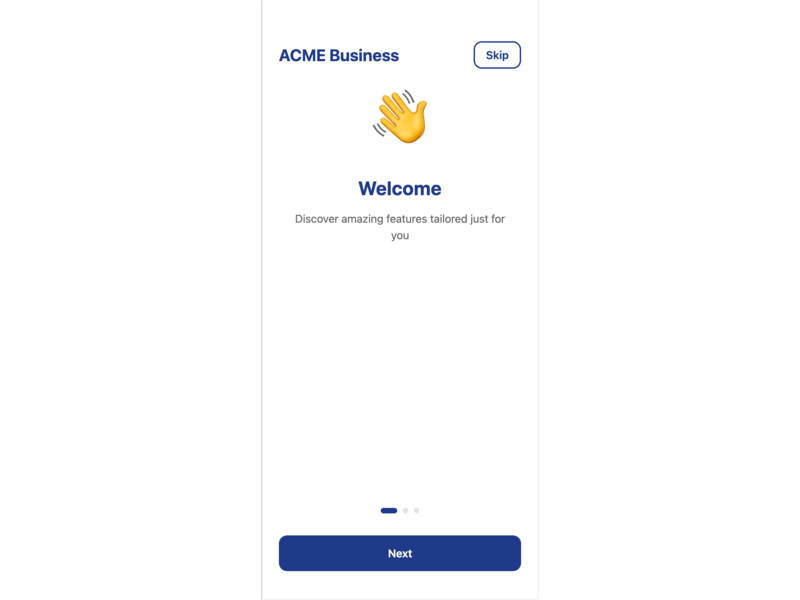
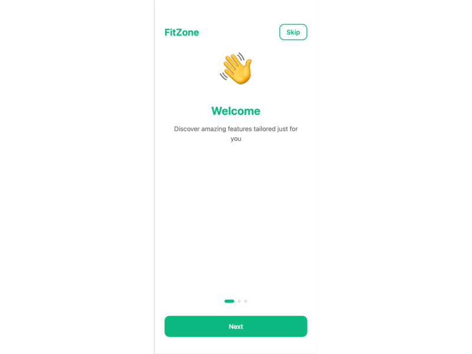
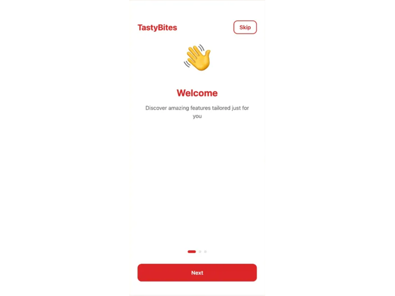
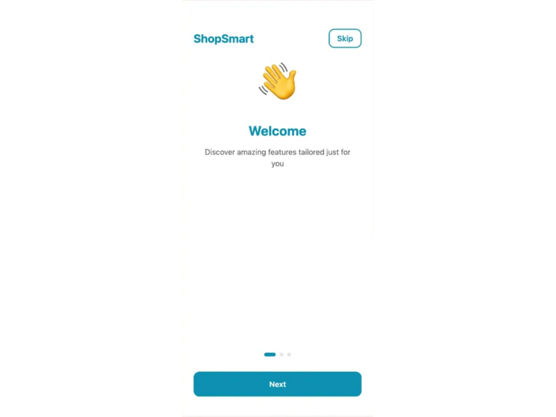
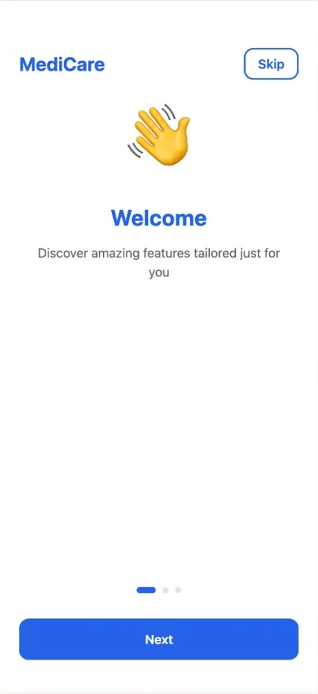

# White Label Multi-Brand App System

[](https://github.com/MichaelEakins/whitelabel-app/releases)
[](./LICENSE)
[](https://expo.dev)
[](https://www.typescriptlang.org/)

**One Codebase. Seven Brands. Infinite Possibilities.**

A production-ready React Native white-label app system that powers multiple completely different apps from a single codebase. Change brands instantly with just an environment variable—no code changes required.

📖 **[View Changelog](./CHANGELOG.md)** • 🚀 **[Quick Start](#quick-start)** • 📊 **[Live Demo](#live-demo-portfolio)** • 🎨 **[Dashboard](#configuration-dashboard)**

---

## Live Demo Portfolio

### Same App, Seven Different Brands

All screenshots below are from the **exact same codebase**—only the `CLIENT` environment variable changes:

#### ACME Business (B2B SaaS)
**Professional Blue & Red Theme**



```bash
CLIENT=acme npm start
```
- **Primary Color**: #1E3A8A (Professional Blue)
- **Industry**: Business Software
- **Features**: Analytics, Team Collaboration, Business Dashboard

---

#### FitZone (Fitness & Wellness)
**Vibrant Green & Orange Theme**



```bash
CLIENT=fitzone npm start
```
- **Primary Color**: #10B981 (Vibrant Green)
- **Industry**: Health & Fitness
- **Features**: Workout Tracking, Nutrition Plans, Challenges

---

#### TastyBites (Food Delivery)
**Appetizing Red & Yellow Theme**



```bash
CLIENT=tastybites npm start
```
- **Primary Color**: #DC2626 (Appetizing Red)
- **Industry**: Restaurant & Delivery
- **Features**: Live Order Tracking, Menu Browser, Loyalty Program

---

#### ShopSmart (E-commerce)
**Modern Teal & Pink Theme**



```bash
CLIENT=shopsmart npm start
```
- **Primary Color**: #0891B2 (Modern Teal)
- **Industry**: Retail & Shopping
- **Features**: Shopping Cart, Wishlist, Product Reviews, Dark Mode

---

#### HomeFinder (Real Estate)
**Professional Navy & Gold Theme**


```bash
CLIENT=homefinder npm start
```
- **Primary Color**: #1E3A8A (Professional Navy)
- **Industry**: Real Estate
- **Features**: Property Search, Virtual Tours, Mortgage Calculator

---

#### MediCare (Healthcare)
**Clean Medical Blue & Green Theme**



```bash
CLIENT=medicare npm start
```
- **Primary Color**: #2563EB (Medical Blue)
- **Industry**: Healthcare
- **Features**: Telemedicine, Health Records, Prescriptions

---

#### TechStartup (Technology Platform)
**Modern Purple & Pink Theme**


```bash
CLIENT=techstartup npm start
```
- **Primary Color**: #6366F1 (Modern Purple)
- **Industry**: Technology
- **Features**: Developer Tools, API Integration, Analytics

---

## Key Features

### Complete White-Label System
- **Zero Code Changes** - Switch brands with environment variable
- **Zod Validation** - All configurations validated before runtime
- **Industry-Specific** - Custom features per client
- **Production Ready** - Separate App Store/Play Store builds

### Visual Configuration Dashboard
- **Web-Based UI** - No coding required to create new clients
- **Live Preview** - See your branding in real-time
- **Color Pickers** - Visual interface for brand colors
- **One-Click Export** - Download ready-to-use config files

### Full App Screens
- **Onboarding** - 3-step welcome flow
- **Authentication** - Login, signup, password recovery
- **Home Dashboard** - Quick actions, activity feed, stats
- **Search** - Categories and discovery
- **Notifications** - Real-time feed
- **Profile/Settings** - User management

### Dynamic Theming
- **Brand Colors** - Primary, secondary, accent, error, success
- **App Identity** - Name, logo, bundle ID
- **Feature Flags** - Enable/disable features per client
- **Custom Configuration** - API URLs, support email, locale

---

## Quick Start

### Prerequisites
- Node.js 18+
- npm or yarn
- Expo CLI

### Installation

```bash
# Clone the repository
git clone https://github.com/MichaelEakins/whitelabel-app.git
cd whitelabel-app

# Install dependencies
npm install

# Generate assets for demo clients
npm run generate-assets acme
npm run generate-assets fitzone
npm run generate-assets tastybites
npm run generate-assets shopsmart
npm run generate-assets homefinder
npm run generate-assets medicare
npm run generate-assets techstartup

# Start the app with a specific client
CLIENT=acme npm start

# Press 'w' to open in web browser
```

### Running Different Clients

```bash
# Professional B2B SaaS
CLIENT=acme npx expo start --clear

# Fitness & Wellness
CLIENT=fitzone npx expo start --clear

# Food Delivery
CLIENT=tastybites npx expo start --clear

# E-commerce
CLIENT=shopsmart npx expo start --clear

# Real Estate
CLIENT=homefinder npx expo start --clear

# Healthcare
CLIENT=medicare npx expo start --clear

# Technology Platform
CLIENT=techstartup npx expo start --clear
```

**Note:** Always use `--clear` when switching between clients to clear Metro bundler cache.

---

## Configuration Dashboard

### Visual UI for Creating White-Label Apps

The included web dashboard provides a **no-code interface** for creating and configuring new white-label apps with live preview.

**Launch the Dashboard:**

```bash
# Navigate to dashboard directory
cd dashboard

# Install dependencies (first time only)
npm install

# Start the dashboard
npm run dev
```

Open **http://localhost:3001** in your browser.

### Dashboard Features

**Visual Configuration:**
- App name and identity fields
- Visual color pickers for all 7 brand colors
- Auto-generation of slugs and bundle identifiers
- Feature flag toggles (auth, notifications, dark mode)
- API endpoint and support email configuration
- Language/locale selection

**Live Mobile Preview:**
- Real-time preview in mobile device frame
- See buttons, headers, and UI elements with your colors
- Preview color palette
- Instant updates as you configure

**One-Click Export:**
- Download fully-formatted configuration file
- Ready to use in the main app
- Includes all necessary fields and comments

### Dashboard Workflow

**Step 1: Configure Your App**

1. Open dashboard at http://localhost:3001
2. Enter your **App Name** (e.g., "My Fitness App")
   - Slug auto-generates (e.g., "myfitnessapp")
   - Bundle IDs auto-generate (e.g., "com.myfitnessapp.app")
3. Choose your **Brand Colors** using visual color pickers:
   - Primary (main brand color)
   - Secondary (accents and highlights)
   - Accent (call-to-action elements)
   - Background, Text, Error, Success
4. Toggle **Feature Flags**:
   - Authentication
   - Push Notifications
   - Dark Mode
5. Set **API Configuration**:
   - API URL (e.g., "https://api.myfitnessapp.com")
   - Support Email
   - Default Language

**Step 2: Live Preview**

Watch the mobile preview update in real-time as you make changes:
- Header shows your app name with primary color
- Buttons display with your chosen colors
- Stats and UI elements update instantly
- Color palette preview at bottom

**Step 3: Export Configuration**

1. Click **"Download Configuration File"** button
2. Save the file to your main project's `configs/` directory
   - File name: `yourapp.config.js`

**Step 4: Deploy Your New App**

```bash
# Back in the main project directory
cd ..

# Generate placeholder assets
npm run generate-assets yourapp

# Validate the configuration
npm run validate yourapp

# Launch your new app
CLIENT=yourapp npx expo start --clear
```

Your branded app is now running with your custom colors and configuration!

### Dashboard vs Manual Configuration

| Method | Best For | Time Required |
|--------|----------|---------------|
| **Dashboard** | Non-technical users, clients, rapid prototyping | 2-5 minutes |
| **Manual Config** | Developers, complex customization, version control | 10-15 minutes |
| **Automated Script** | CLI users, automation, batch creation | 1 minute |

**Recommendation:** Use the dashboard for initial configuration and rapid iteration, then commit the exported config file to version control.

### Dashboard Documentation

For complete dashboard documentation, see [dashboard/README.md](./dashboard/README.md)

---

## Project Structure

```
whitelabel-app/
├── app/                          # Expo Router screens
│   ├── (auth)/                   # Authentication flow
│   │   ├── login.tsx
│   │   ├── signup.tsx
│   │   └── forgot-password.tsx
│   ├── (onboarding)/             # Onboarding flow
│   │   └── index.tsx
│   ├── (tabs)/                   # Main app tabs
│   │   ├── index.tsx             # Home/Dashboard
│   │   ├── search.tsx
│   │   ├── notifications.tsx
│   │   └── profile.tsx
│   └── _layout.tsx               # Root layout
├── components/                   # Reusable components
│   ├── Button.tsx                # Themed button
│   ├── Input.tsx                 # Themed input
│   └── Card.tsx                  # Themed card
├── configs/                      # Client configurations
│   ├── acme.config.js
│   ├── fitzone.config.js
│   ├── tastybites.config.js
│   ├── shopsmart.config.js
│   ├── homefinder.config.js
│   ├── medicare.config.js
│   ├── techstartup.config.js
│   └── default.config.js
├── dashboard/                    # Configuration UI
│   ├── app/                      # Next.js pages
│   ├── components/               # Dashboard components
│   ├── utils/                    # Config generator
│   └── README.md                 # Dashboard docs
├── hooks/                        # Custom hooks
│   └── useTheme.ts               # Theme hook
├── validation/                   # Zod schemas
│   └── configSchema.js
├── scripts/                      # Utility scripts
│   ├── new-client.js
│   ├── validate-config.js
│   ├── generate-png-placeholders.js
│   └── demo-setup.sh
├── assets/                       # Client assets & screenshots
│   ├── acme/
│   ├── fitzone/
│   ├── tastybites/
│   ├── shopsmart/
│   ├── homefinder/
│   ├── medicare/
│   ├── techstartup/
│   ├── acme.png                  # Screenshot
│   ├── fitzone.png               # Screenshot
│   ├── tastybites.png            # Screenshot
│   ├── shopsmart.png             # Screenshot
│   ├── homefinder.png            # Screenshot
│   ├── medicare.png              # Screenshot
│   └── techstartup.png           # Screenshot
├── app.config.js                 # Dynamic Expo config
└── package.json
```

---

## How It Works

### 1. Configuration-Driven Architecture

Each client has a configuration file in `configs/`:

```javascript
// configs/fitzone.config.js
module.exports = {
  appName: 'FitZone',
  slug: 'fitzone',
  scheme: 'fitzone',
  
  brandColors: {
    primary: '#10B981',    // Vibrant Green
    secondary: '#F59E0B',  // Energetic Orange
    accent: '#EF4444',     // Active Red
  },
  
  features: {
    workoutTracking: true,
    nutritionPlans: true,
    challenges: true,
  },
  
  apiUrl: 'https://api.fitzone.app',
  supportEmail: 'support@fitzone.app',
};
```

### 2. Dynamic Theme Hook

Components use the `useTheme` hook to access client configuration:

```typescript
import { useTheme } from '../hooks/useTheme';

function MyComponent() {
  const { colors, config } = useTheme();
  
  return (
    <View style={{ backgroundColor: colors.primary }}>
      <Text>{config.appName}</Text>
    </View>
  );
}
```

### 3. Automatic Theming

All components automatically adapt to the client's brand:

```typescript
// Button component
<Button
  title="Get Started"
  onPress={handlePress}
  variant="primary"  // Uses colors.primary automatically
/>
```

### 4. Zod Validation

All configurations are validated before runtime:

```bash
npm run validate fitzone

✅ Configuration validated successfully
```

---

## Creating a New Client

You have **three options** for creating new white-label apps:

### Option 1: Visual Dashboard (Recommended)

**Best for:** Non-technical users, rapid prototyping, visual customization

```bash
# Start the dashboard
cd dashboard
npm install  # First time only
npm run dev

# Open http://localhost:3001
# Configure visually, download config file
# Save to configs/yourapp.config.js
```

### Option 2: Automated CLI Script

**Best for:** Developers, quick setup, automation

```bash
npm run new-client mycompany "My Company Name"
npm run generate-assets mycompany
npm run validate mycompany
CLIENT=mycompany npm start
```

### Option 3: Manual Configuration

**Best for:** Full control, complex customization, learning the system

1. **Create configuration file**: `configs/mycompany.config.js`

```javascript
module.exports = {
  appName: 'My Company',
  slug: 'mycompany',
  scheme: 'mycompany',
  version: '1.0.0',
  
  icon: './assets/mycompany/icon.png',
  splash: {
    image: './assets/mycompany/splash.png',
    resizeMode: 'contain',
    backgroundColor: '#YOUR_COLOR',
  },
  
  ios: {
    bundleIdentifier: 'com.mycompany.app',
  },
  
  android: {
    package: 'com.mycompany.app',
    adaptiveIcon: {
      foregroundImage: './assets/mycompany/adaptive-icon.png',
      backgroundColor: '#YOUR_COLOR',
    },
  },
  
  brandColors: {
    primary: '#YOUR_PRIMARY',
    secondary: '#YOUR_SECONDARY',
    accent: '#YOUR_ACCENT',
    background: '#FFFFFF',
    text: '#000000',
    error: '#FF3B30',
    success: '#34C759',
  },
  
  features: {
    auth: true,
    notifications: true,
    // ... your features
  },
  
  apiUrl: 'https://api.mycompany.com',
  supportEmail: 'support@mycompany.com',
  locale: 'en',
};
```

2. **Generate placeholder assets**:
```bash
npm run generate-assets mycompany
```

3. **Validate configuration**:
```bash
npm run validate mycompany
```

4. **Launch your app**:
```bash
CLIENT=mycompany npm start
```

---

## Building for Production

### Development Build (for testing on devices)

```bash
# iOS
CLIENT=fitzone eas build --profile development --platform ios

# Android
CLIENT=fitzone eas build --profile development --platform android
```

### Production Build (for App Store/Play Store)

```bash
# iOS App Store
CLIENT=fitzone eas build --platform ios

# Android Play Store
CLIENT=fitzone eas build --platform android
```

Each client produces a completely separate app with:
- Different app name
- Different bundle identifier
- Different branding
- Different features
- Separate App Store listing

---

## Technical Stack

| Category | Technology |
|----------|-----------|
| **Framework** | React Native (Expo SDK 54) |
| **Routing** | Expo Router (file-based) |
| **Language** | TypeScript |
| **Validation** | Zod schemas |
| **State Management** | React Hooks |
| **Navigation** | React Navigation |
| **Theming** | Custom `useTheme` hook |
| **Build System** | EAS Build |
| **Dashboard** | Next.js 14 + Tailwind CSS |

---

## Use Cases

### For Agencies
- **Deploy multiple client apps** from one codebase
- **700% ROI** - 7 apps from 1 codebase
- **Client self-service** - Let clients configure via dashboard
- **Rapid onboarding** - Dashboard makes setup visual and fast
- **Consistent updates** - Fix once, deploy everywhere

### For SaaS Companies
- **White-label your platform** for customers
- **Self-service portal** - Customers configure their own branding
- **Scale to unlimited clients** with minimal overhead
- **Maintain single codebase** for all deployments
- **Automated deployment** - From dashboard to app store

### For Enterprises
- **Multiple brand portfolios** (e.g., regional brands)
- **Consistent UX** across all brands
- **Non-technical teams** can create variants via dashboard
- **Centralized maintenance** and updates
- **Brand-specific features** via feature flags

---

## Documentation

- [Complete Setup Guide](./SETUP.md)
- [Quick Start Guide](./QUICKSTART.md)
- [Demo Presentation](./DEMO.md)
- [Screen Documentation](./SCREENS.md)
- [Deployment Guide](./DEPLOYMENT.md) ⭐
- [Dashboard Documentation](./dashboard/README.md)
- [Zod Validation Guide](./docs/ZOD_VALIDATION.md)
- [Validation Quick Reference](./docs/VALIDATION_QUICK_REF.md)
- [Changelog](./CHANGELOG.md)

---

## Contributing

Contributions are welcome! Please feel free to submit a Pull Request.

---

## License

This project is licensed under the MIT License - see the LICENSE file for details.

---

## Acknowledgments

Built with:
- [Expo](https://expo.dev)
- [React Native](https://reactnative.dev)
- [Expo Router](https://docs.expo.dev/router/introduction/)
- [Next.js](https://nextjs.org)
- [Zod](https://zod.dev)
- [Tailwind CSS](https://tailwindcss.com)

---

## 🚀 Deployment Guide

### Version 1.0.0 Deployment

**Pre-Deployment Checklist:**

```bash
# 1. Validate all client configurations
npm run validate acme
npm run validate fitzone
npm run validate tastybites
npm run validate shopsmart
npm run validate homefinder
npm run validate medicare
npm run validate techstartup

# 2. Ensure all assets are generated
npm run generate-assets acme
npm run generate-assets fitzone
# ... repeat for all clients

# 3. Test locally
CLIENT=acme npm start
# Test all critical flows before production build
```

**Production Deployment:**

```bash
# iOS App Store Build
CLIENT=acme eas build --platform ios --profile production

# Android Play Store Build
CLIENT=acme eas build --platform android --profile production

# Submit to stores (after successful build)
eas submit --platform ios --latest
eas submit --platform android --latest
```

**Multi-Client Batch Deployment:**

```bash
# Build all clients for iOS
for client in acme fitzone tastybites shopsmart homefinder medicare techstartup; do
  CLIENT=$client eas build --platform ios --profile production --non-interactive
done

# Build all clients for Android
for client in acme fitzone tastybites shopsmart homefinder medicare techstartup; do
  CLIENT=$client eas build --platform android --profile production --non-interactive
done
```

**Version Management:**

- Version is managed in `package.json` (currently 1.0.0)
- EAS Build auto-increments build numbers (configured in `eas.json`)
- Update version for major releases: `npm version major|minor|patch`

**Post-Deployment:**

1. Tag the release: `git tag -a v1.0.0 -m "Version 1.0.0 Release"`
2. Push tags: `git push origin v1.0.0`
3. Create GitHub release with CHANGELOG notes
4. Update documentation if needed
5. Monitor crash reports and user feedback

---

## Support

For questions and support:
- **GitHub Issues**: [Create an issue](https://github.com/MichaelEakins/whitelabel-app/issues)
- **Email**: contact@crashbytes.com
- **Documentation**: Full guides available in [/docs](./docs)
- **Community**: [Discussions](https://github.com/MichaelEakins/whitelabel-app/discussions)

---

**Made with love for developers who need to deploy multiple branded apps efficiently**

*One codebase. Unlimited brands. Infinite possibilities.*
